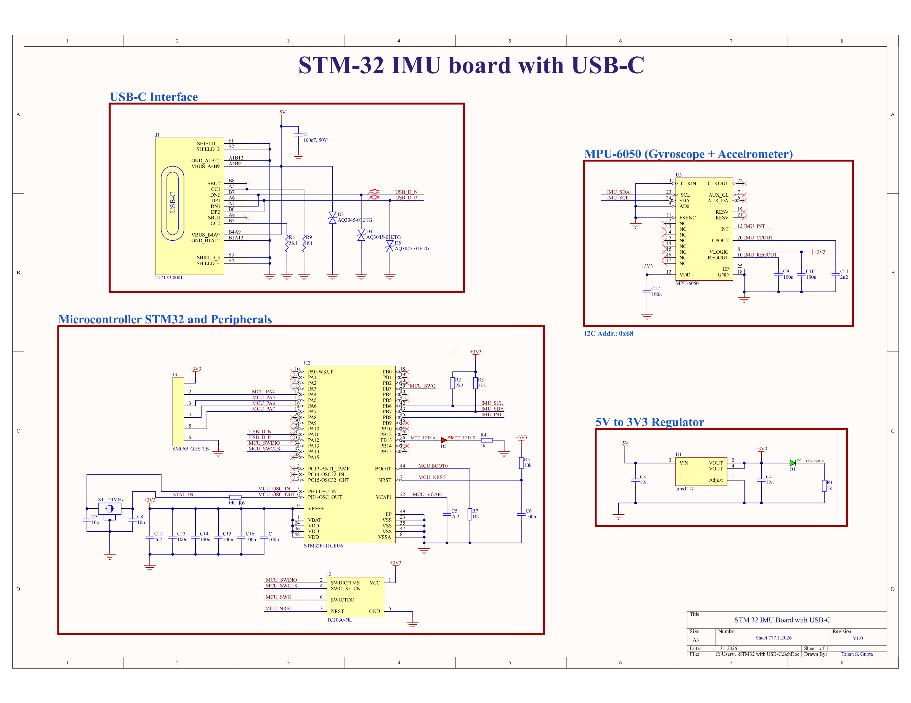
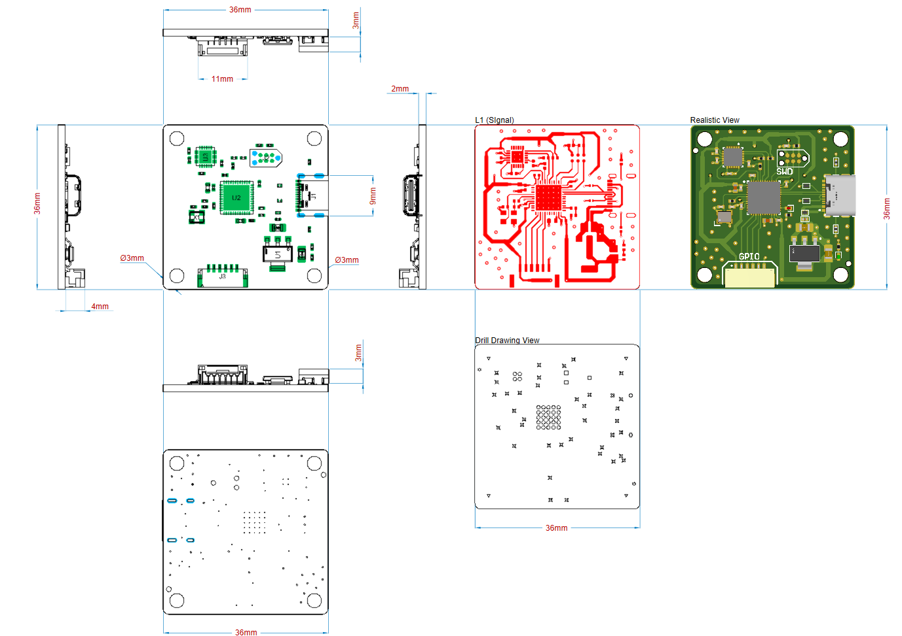
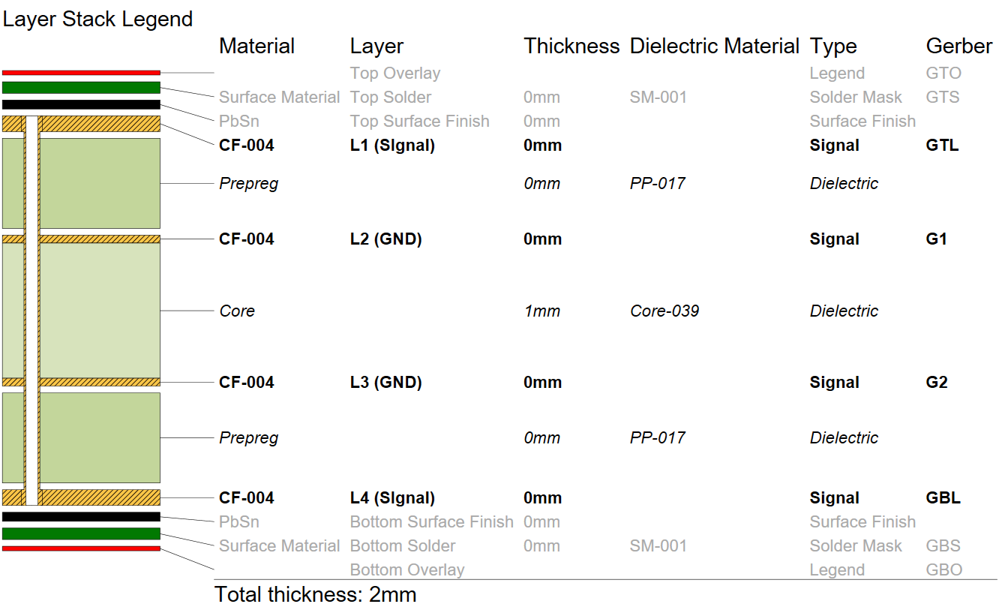
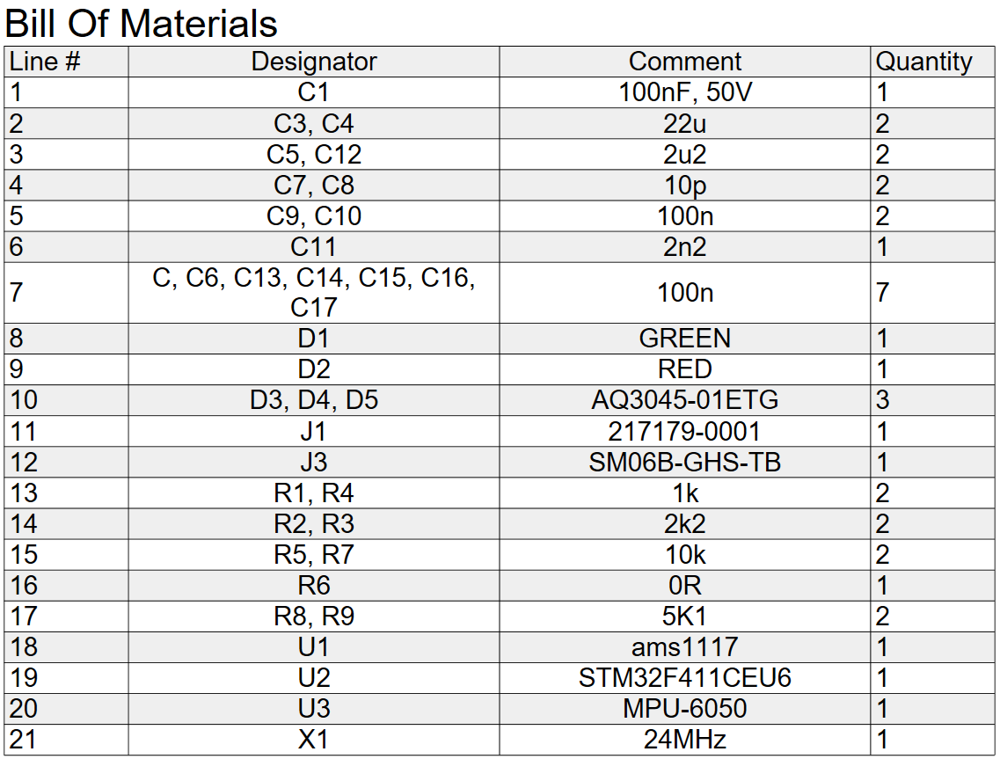
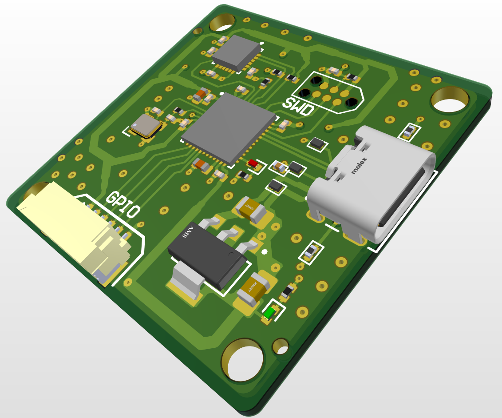

# STM32-Based Inertial Measurement Unit (IMU) Module with USB-C

## 1. Project Overview

This project presents a **custom STM32-based inertial measurement unit (IMU) module** built around the **STM32F411CEU6** microcontroller and the **MPU-6050** six-axis motion sensor. The board is designed as a compact embedded platform for motion sensing, orientation tracking, and IMU data acquisition.

A **USB Type-C interface** is used for both **power delivery and data communication**, allowing IMU data to be transferred directly to a host system while providing a robust and reversible physical connector. The design integrates USB protection circuitry and a regulated power architecture suitable for reliable embedded operation.

The complete schematic and PCB layout were developed in **Altium Designer**, following established industry practices for power integrity, grounding, and multilayer PCB design.

---

## 2. System Workflow

The following diagram illustrates the high-level operational workflow of the STM32-based IMU module, including power delivery, motion sensing, data processing, and host communication.

---

## 3. System Architecture

At a system level, the module consists of four primary functional blocks:

- USB-C interface for power and USB 2.0 data
- Power regulation subsystem generating a stable 3.3 V rail
- STM32F411 microcontroller for control and processing
- MPU-6050 IMU for motion sensing

The STM32 acts as the central controller, acquiring motion data from the IMU over I²C, processing it in firmware, and transmitting it to an external host via USB.

|----------|---------|
| **Design Notes**   This is some explanatory text about the schematic. You can add more details here, like what each block represents or why certain components are used. |  |
---

## 4. Hardware Design

### 4.1 MCU Subsystem

The microcontroller subsystem is based on the **STM32F411CEU6**, an ARM Cortex-M4 device with floating-point support.

Key design aspects include:
- External **24 MHz crystal oscillator** for accurate system timing
- SWD interface for programming and debugging
- Dedicated decoupling capacitors placed close to VDD pins
- Clean ground reference through continuous internal ground planes

The MCU is configured as a USB device and manages sensor communication, data handling, and host interaction.

---

### 4.2 IMU Subsystem

The motion sensing subsystem uses the **MPU-6050**, providing:
- 3-axis accelerometer
- 3-axis gyroscope

Design characteristics:
- Communication via I²C bus
- On-board I²C pull-up resistors
- IMU interrupt pin routed to the STM32 for event-driven data handling
- Placement optimized to reduce noise coupling from power and USB traces

The interrupt line enables efficient motion data acquisition without constant polling.

---

### 4.3 Power & USB-C Subsystem

Power is supplied through a **USB Type-C connector (217179-0001)** configured for USB 2.0 operation.

Key elements:
- 5 V input from USB-C
- **AMS1117 LDO** regulating 5 V down to 3.3 V
- USB ESD protection using **AQ3045-01ETG** diodes
- Common 3.3 V rail shared by MCU and IMU

The USB-C port supports both power input and data transfer, enabling a single-cable interface for development and data logging.

---

## 5. PCB Stackup & Layout

The PCB uses a **4-layer stackup** to improve signal integrity and reduce noise.

- Dedicated internal ground planes provide a low-impedance return path
- Extensive ground stitching vias are used to minimize EMI
- Sensitive IMU signals are routed away from high-speed USB traces

Board dimensions: **36 cm × 36 cm**

---

## 6. Firmware Overview

The firmware workflow is centered around **STM32CubeIDE**, which was used to configure:
- MCU pin assignments
- Clock sources
- Peripheral initialization

The firmware is intended to:
- Initialize I²C communication with the IMU
- Handle IMU interrupt events
- Read and process motion data
- Transmit sensor data to a host system over USB

---

## 7. Power Budget

The system operates from a 5 V USB input, regulated to 3.3 V for logic and sensing.

- STM32F411 microcontroller powered from 3.3 V
- MPU-6050 IMU powered from 3.3 V
- AMS1117 LDO selected to support the expected load current

---

## 8. Testing & Validation

Design validation focused on:
- Power rail continuity and voltage regulation
- USB signal routing and ESD protection
- I²C connectivity between MCU and IMU
- Interrupt routing from IMU to MCU

---

## 9. Known Limitations

- No battery power support
- No USB-C Power Delivery negotiation
- Designed primarily for USB-powered operation
- Limited expansion interfaces

---

## 10. Future Improvements

- Addition of USB-C Power Delivery support
- Integration of higher-precision IMU
- On-board non-volatile memory
- Expanded communication interfaces (SPI, CAN)

---

## 11. Bill of Materials (BOM)

The following image provides a detailed overview of the major components used in the design, including the microcontroller, IMU, power regulation, USB-C interface, and protection devices.

---

## 12. 3D Model & Mechanical

A complete 3D model of the PCB is available for mechanical reference and enclosure design.

Download the 3D model:  
[PCB STEP Model](docs/3d/stm32-imu-board.step)

---

## 13. License

This project is licensed under the **MIT License**.  
See the [LICENSE](LICENSE) file for details.
